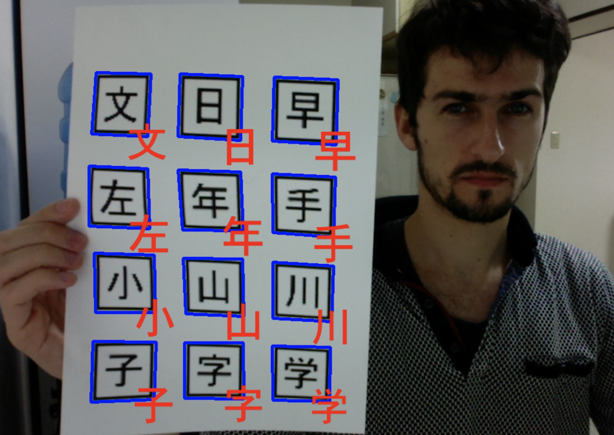

# printed_characters_net

`Printed characters net` is a project that demonstrates use of neural networks for characters recognition.
It contains code to train neural networks to detect printed characters in real time video, like in screenshot below.

The network is capable to learn to detect reasonably well as much as 250 different characters, including Latin alphabet, digits, hiragana, katakana and kanji.

The core logic of the project is contained in scripts directory, which consists of following programs:
- `data/`
    - `create_templates.py` - creates plain images of characters we want to recognize
    - `create_templates_printout.py` - creates a pdf with template images that can be cut out to later use them in real-time detection
    - `create_data.py` - using templates obtained from `create_templates_printout.py` and a camera, capture characters images that can be used for training
    - `create_artificial_data.py` - given templates, create an artificially augmented dataset used for training
- `training/`
    - `train_mnist.py` - a sanity check script to make sure our neural network can learn standard MNIST set
    - `train_characters.py` - script for training neural network to detect templates
- `debugging/`
    - `debug_characters_network.py` - prints out most common mistakes made by characters network
    - `load_characters_net.py` - checks characters net can be successfully loaded, evaluates its accuracy
    - `load_mnist_net.py` - checks mnist net can be successfully loaded, evaluates its accuracy
    - `visualize_net_training.py` - plots training statistics of network over time
- `detection.py` - detect printed templates in real time video stream

You can see the detection in action in [this Youtube video](https://youtu.be/AXWB80zUxd8). This particular network was trained on artificial data to detect 80 different kanji characters. As you can see, it gets many of them right, and mistakes it makes are mostly plausible.

Notes on data: 

1. You can control amount of artificial data created with constants defined in `create_artificial_data.py`. Given ~250 labels I recommend going for ~400 images per label - this should let you create all data and train the classifier to ~95% accuracy on artificial data in under 15mins on an decent machine. You can get 90% results in 5mins or so when using 250 images per label.
2. Best results are of course obtained with real data, but even artificial data can work really well, especially if characters set is constrained to a small size, say only Latin characters.
3. Naturally the smaller the overall characters set, the easier the task becomes for the net. You can control the set size by modifying `create_templates.py`. Don't forget to wipe out old data and rerun other setup scripts afterwards.

NOTE:
This project uses mostly plain numpy for neural networks code. I'm aware of frameworks like Theano and Tensorflow that could do a lot of heavy lifting for me, while at the same time providing faster execution on Nvidia GPUs, but my main goal for this project is to check my own understanding of neural networks concepts. Hence I strive to implement all steps of the learning algorithm from a scratch.
