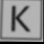
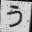
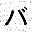
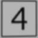
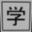

# printed_characters_net

This project is a work in progress. Currently it's about ~80% complete.

`Printed characters net` is a project that demonstrates use of neural networks for characters recognition.
The idea is to be able to detect in real time video characters like below:

    

Current network design is capable of learning to detect over 250 characters (Latin alphabet, digits, hiragana, katanaka and Jouyou Level 1 kanji) with about ~95% accuracy in ~10mins of training on MacBook Pro 2014. Another two hours of training can raise this to ~98%.

The core logic of the project is contained in scripts directory, which consists of following programs:
- `create_templates.py` - creates plain images of characters we want to recognize
- `create_templates_printout.py` - creates a pdf with template images that can be cut out to later use them in real-time detection
- `create_data.py` - given templates, create an artificially augmented dataset used for training and evaluating a neural network
- `train_mnist.py` - a sanity check script to make sure our neural network can learn standard MNIST set
- `train_characters.py` - script for training neural network to detect templates
- `detection.py` - detect printed templates in real time video stream

Notes on data size: You can control amount of artificial data created with constants defined in `create_data.py`. Given ~250 labels I recommend going for ~400 images per label - this should let you create all data and train the classifier to ~95% accuracy in under 10mins on a decent machine.

TODO:
- add a softmax output layer to neural network code. Current code uses a plain sigmoid outputs layer and it would be nice to give a confidence of each prediction. The forward step isn't of course any difficult, but I need to yet figure out what the correct cost derivative is for softmax layer.
- wire neural network to `detection.py`. At present `detection.py` takes care of detecting rectangular card outlines, but neural network isn't yet plugged in, so no templates detection is performed yet.

NOTE:
This project uses mostly plain numpy for neural networks code. I'm aware of frameworks like Theano and Tensorflow that could do a lot of heavy lifting for me, while at the same time providing faster execution on Nvidia GPUs, but my main goal for this project is to check my own understanding of neural networks concepts. Hence I strive to implement all steps of the learning algorithm from a scratch.
